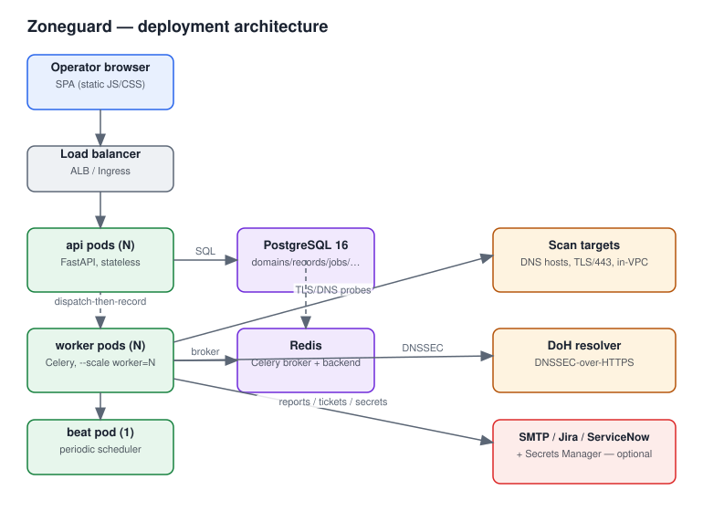

# Zoneguard

DNS attack-surface and TLS-posture platform. Ingests AWS Route 53 DNS dumps and continuously
analyzes every record for TLS quality, post-quantum readiness, liveness, certificate health,
security headers, DNSSEC status, and dangling/subdomain-takeover cleanup risk — "SSL Labs +
attack-surface management + DNS hygiene" scoped to an organization's own hosted zones.



## Why

A security team with dozens of Route 53 hosted zones has no single view of: which endpoints
are live, which have weak or outdated TLS, which are post-quantum-ready, which certs are
expiring, which DNS records are dangling (pointing at deleted cloud resources —
subdomain-takeover risk), and which stale ACM validation records are safe to clean up.
Zoneguard turns a raw R53 export into a prioritized, filterable, zone-segmented posture
dashboard, plus scheduled diff-digest reports and auto-filed tickets.

## Quick start

```bash
cp .env.example .env   # adjust if you want non-default settings
docker compose up --build -d --scale worker=3
```

This brings up `api` + 3 `worker` pods + `beat` + Postgres + Redis. On first boot the app:

1. Runs database migrations (idempotent — safe to re-run).
2. Creates a first admin user and **prints its password once to the api container logs**
   (`docker compose logs api | grep -A3 "FIRST-BOOT ADMIN"`) unless `ADMIN_BOOTSTRAP_PASSWORD`
   is set beforehand, or OIDC is configured.
3. Seeds a small **synthetic** demo dataset (fabricated `example.com`-family records — never
   a real customer dump) so the UI has something to show immediately.

Open http://localhost:8000, sign in with the bootstrap admin, and explore. See
[docs/how-to-run.md](docs/how-to-run.md) for the full walkthrough (uploading a dump,
triggering a scan, reading the dashboard).

## Architecture

One Docker image, three roles selected by `$ROLE` at the compose `command` level — this
topology maps 1:1 onto ECS/EKS pods:

| Role | Count | What it does |
|---|---|---|
| `api` | N, stateless, behind a load balancer | FastAPI + the static SPA |
| `worker` | N, horizontally scaled | Celery workers doing the actual scanning |
| `beat` | exactly 1 | periodic scheduler: retention pruning, stuck-job reconciliation, daily snapshots, report-schedule checks |

Shared Postgres 16 is the system of record; Redis is the Celery broker/result backend. See
[docs/data-flow.svg](docs/data-flow.svg) for how a dump moves from upload through parsing,
grading, and cleanup detection.

**Scan from inside the VPC.** Workers must be deployed with network reach to internal
targets (ELBs, private subnets) for internal-only hosts to read as "up" rather than falsely
"down". `ALLOW_RFC1918_SCAN_TARGETS=true` opts into scanning private-range targets once that
network placement is in place.

## Core functionality

- **Ingest**: enriched CSV, bare CSV, BIND zone files, or Route 53 JSON — auto-detected. One
  dump can span many hosted zones; an explicit `Zone`/`HostedZone` column (or the S3
  connector's per-object convention) groups records correctly even when a zone's apex isn't a
  bare registrable domain. An S3 connector (`latest`/`all`/`new` modes) supports the
  Lambda→S3→Zoneguard flow using the container's IAM role.
- **Scanning**: real network probes — TLS protocol matrix (SSLv3 through 1.3), full TLS1.3
  ciphersuite enumeration and live PQC (`X25519MLKEM768`) detection, TLS1.2 weak-cipher
  probing, certificate analysis, security headers, liveness with a specific down reason, and
  DNSSEC status over DoH.
- **Grading**: three separate grades per record — `tls_grade` (A+…F, plus T/-), `header_grade`
  (0–100), and a blended overall `grade`, capped to F/T whenever the TLS side is.
- **Cleanup detection**: dangling-CNAME fingerprint matching against known dead cloud-resource
  patterns, ACM/DCV validation-record recognition (never auto-suggested for deletion unless
  provably orphaned), and a weighted 0–100 cleanup-confidence score with verify-before-delete
  guidance.
- **Reporting & ticketing**: diff-digest email schedules (per-zone, with a live preview),
  Jira/ServiceNow ticket creation for new dangling records.
- **Operational hardening**: dispatch-then-record job creation with a stuck-job reconciler,
  fail-fast liveness gating, flap damping (including on grades), retention pruning, and
  server-side pagination on every list.

The full behavioral spec and the hard-won engineering lessons it encodes are described
module-by-module in the code — see in particular `app/scanning/`, `app/grading/`,
`app/cleanup/`, and `app/jobs/dispatch.py`.

## Documentation

- [How to run](docs/how-to-run.md) — local dev, the demo walkthrough, configuration reference
- [Secrets & AWS setup](docs/secrets-and-aws-setup.md) — IAM roles, Secrets Manager, OIDC, S3 connector
- [Contributing](docs/contributing.md) — running tests, code layout, adding a probe
- [Roadmap](docs/roadmap.md)
- [SAST report](docs/sast-report.md)

## Testing

```bash
docker compose run --rm -e ROLE=test api        # full pytest suite, in-container (needs
                                                 # OpenSSL >=3.5 and Python 3.13 — never run
                                                 # against the host's Python)
```

## License

Internal tool — no license file included; adapt as needed for your organization.
